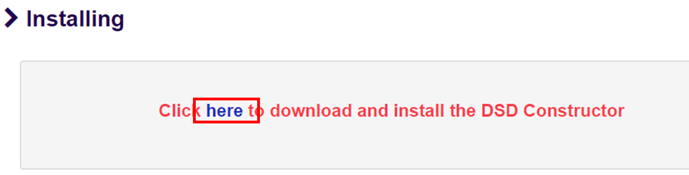
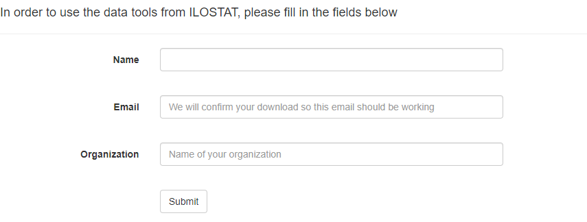

# Getting Started {#getting-started}

In this chapter, you will find information about the installation process of SDMX Constructor in a Windows environment. Specifically, it will cover the system requirements necessary to install the software, the steps required to download the executable file and the subsequent installation process. The chapter will also explain the software update process, providing practical guidance on keeping your SDMX Constructor current.

## System requirements

Before installing any desktop software, ensuring the computer meets the necessary system requirements is essential. These requirements can include hardware specifications like processor speed, memory, and storage capacity, as well as software prerequisites like operating system version and other dependencies. Find below the minimum system requirements for installing and running SDMX Constructor.

- 	Windows 7 or later in both 32- and 64-bit environments
- 	.NET 4.5.2 or later with all updates and patches
- 	200MB disk space for the software

## Installation

**Step 1**: Visit the site https://ilostat.github.io/dsdc/ and click on the INSTALL menu option (as shown below).

```{r ILO-header, echo=FALSE, fig.align="center", out.width="100%"}

```

**Step 2**: In the resulting page, click on “here” (as shown below) 

```{r here, echo=FALSE, fig.align="center", out.width="100%"}

```

**Step 3**: An interface (as shown below) will open, requiring you to enter a few details (your name, your email, and the name of your organisation (if applicable)). 

```{r contact-details, echo=FALSE, fig.align="center", out.width="100%"}

```

**Step 4**: The download will start when you fill in the form and submit the information. The software installer file, named “ILOSTAT_DSD_Constructor_Setup.exe”, will be downloaded. 

**Step 5**: Double-click on this file to begin the installation process. Select ‘Install’ on the security message and wait for the installation process to complete.


## Software updates

The SDMX Constructor updates itself to the latest version (if available) using the ClickOnce Deployment technique. This method ensures a streamlined installation process with minimal user involvement. An internet connection is required when launching the application to initiate the update. The software will check for available updates and automatically download and install them in the background without requiring any input from the user. This feature helps to ensure that users always have access to the latest version of the software, with the latest bug fixes, performance improvements, and new features.

