# User Interface {#user-interface}

This chapter will provide you with a comprehensive guide on the main aspects of the SDMX Constructor’s user interface. It will cover three main topics. The first topic will be an overview of the user interface, including a detailed explanation of the various menu options and the working area. The second topic will focus on the inputs and outputs of SDMX Constructor. It will cover the different input and output options available. The third topic will provide an overview of the translation functionality in SDMX Constructor.

## General Functions Menu

In the top right corner (as highlighted below), the first group of buttons (General Functions) shows the items applicable to the whole tool. They include Reset, Support, Locale and Registry. See Table 3.1 for a brief overview of the menu items.

```{r 011, echo=FALSE, fig.align="center", out.width="100%"}
knitr::include_graphics("./images/image011.png")
```
[Click here to enlarge the image](images/image011.png)

| Menu item    | What to expect: A bird's-eye view of General Functions                                                                                                                                                                                                                                                                                                                                                                                                                                                                                                        |
|---------------------|---------------------------------------------------|
| **Reset**    | The Reset button resets the tool to its default settings. It removes all the inputs and initiates a fresh start.                                                                                                                                                                                                                                                                                                                                                                                                                                              |
| **Support**  | The Support button launches the default email application on a computer, with a new email message addressed to the support team for the tool, ready to be composed and sent.                                                                                                                                                                                                                                                                                                                                                                                  |
| **Locale**   | The Support button launches the default email application on a computer, with a new email message addressed to the support team for the tool, ready to be composed and sent.                                                                                                                                                                                                                                                                                                                                                                                  |
| **Registry** | The Registry button provides several options for users to configure their settings. For example, users can specify the connection details of the SDMX registry (either a local folder or local instance (localhost) or online) and connect with the Data Lifecycle Manager (DLM) component of the .Stat Suite. In addition, the button allows specifying the proxy settings for the internet connection if a proxy is needed. There are also options for entering authentication credentials for automated translation using Google Translation or DeepL API. |

: (#tab:table31) A bird's-eye view of the menu items in the top right corner (General Functions)

## Editors Menu

The second group of menu items (Editors) shows the options in the top left corner (as highlighted below). They include Codelist, ConceptScheme, Table Modeller, DSD, Dataflow, ConceptConstraint, AgencyScheme, CategoryScheme and MSD. Each menu item is an entry point for creating and editing a specific artefact. Clicking on any of the options will reveal more particular options below. See Table 3.2 for a brief overview of the menu items (Editors).

```{r 013, echo=FALSE, fig.align="center", out.width="100%"}
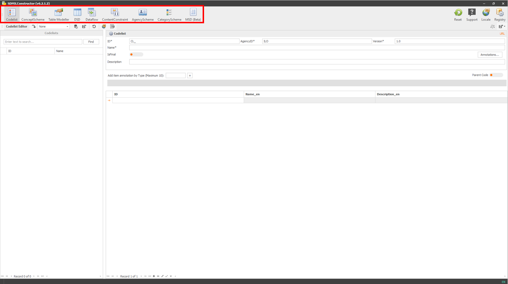
```
[Click here to enlarge the image](images/image013.png)

| Menu item             | What to expect: A bird's-eye view of the menu items in the top left corner (Editors)                                                                                                                                                                                                         |
|---------------------|---------------------------------------------------|
| **Codelist**          | The Codelist button shows an interface to create or edit the list of Concepts (dimensions/attributes of a modelled dataset), each having a list of possible values or codes. The codes have unique IDs and (multilingual) labels and may have other information such as order and hierarchy. |
| **ConceptScheme**     | The ConceptScheme button shows an interface to create or edit the Concepts (dimensions/attributes of a modelled dataset). Each concept has an ID and (multilingual) labels and may have other information.                                                                                   |
| **Table Modeller**    | The Table Modeller button shows the options to generate the SDMX artefacts by recreating the statistical table using the Concepts (dimensions/attributes of a modelled data set) with an intuitive user interface (drag and drop).                                                           |
| **DSD**               | The DSD button abbreviating Data Structure Definition shows an interface to create or edit the structure of a modelled dataset. It specifies the dimensions, attributes and their possible values or codes.                                                                                  |
| **Dataflow**          | The Dataflow button shows an interface to create or edit a subset and representation of a DSD and describes which dimensions to show on rows or columns.                                                                                                                                     |
| **ConceptConstraint** | The ConceptConstraint button shows an interface to create or edit combinations of codes that are allowed for various artefacts of the dataflows.                                                                                                                                             |
| **AgencyScheme**      | The AgencyScheme button shows an interface to create or edit a hierarchical list of agencies or organisations. Each agency or organisation is identified by a unique code (ID), a name, and other descriptive information.                                                                   |
| **CategoryScheme**    | The CategoryScheme button shows an interface to create or edit a CategoryScheme, which is essentially a list of categories organised in a hierarchical structure. Each category is identified by a unique code (ID), a name, and other descriptive information.                              |
| **MSD**               | The MSD button abbreviating Metadata Structure Definition shows an interface describing the structure of reference metadata associated with a data set. It specifies the elements and attributes that can be used to represent metadata concepts and the relationships between them.         |

: (#tab:table32) A bird's-eye view of the menu items in the top left corner (Editors)

## Editor Ribbon Menu

The third group of menu items (Editor Ribbon) are in the top left corner and below the second group of menu items (as highlighted below).

```{r 015, echo=FALSE, fig.align="center", out.width="100%"}
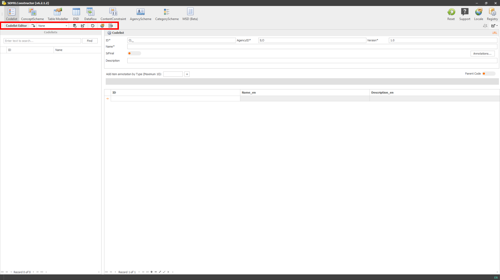
```
[Click here to enlarge the image](images/image015.png)

It contains icons that represent the most commonly used features of the selected options above, and hovering over each icon will reveal a tooltip that describes its function. The options available in this group of menu items change according to the menu item selected on the top menu.

Below are the icons representing the menu items (Editor Ribbon) and their functions. Users can change the size of these icons by right-clicking on any of them, selecting Customize, and selecting the appropriate setting in Options.

| Menu item                  | Names and functions                                                                                                                            |
|---------------------|---------------------------------------------------|
| 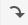   | Load from Registry. Select from a dropdown list to load.                                                                                       |
| 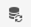   | Refresh the registry.                                                                                                                          |
| 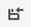   | Import. Allows to import an SDMX XML file locally.                                                                                             |
| 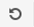   | Reset the current Editor inputs.                                                                                                               |
| 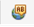   | Translation Service. Provide inline translations for names and descriptions via translation API or manually if needed.                         |
| 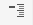   | Collapse DSDs.                                                                                                                                 |
| 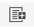   | Bulk load. Allows to upload multiple items (if available) by copying and pasting.                                                              |
| 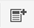   | Add New Concept (e.g., Agency or Category). Depending on which Editor is active, e.g., it can help add a new agency if it is for AgencyScheme. |
| 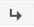   | Load Concept.                                                                                                                                  |
| 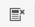   | Delete Selected Concepts.                                                                                                                      |
|  | Move Up.                                                                                                                                       |
| 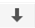   | Move Down.                                                                                                                                     |

: (#tab:table33) A bird's-eye view of the menu items in the Editor Ribbon

If a user chooses "Codelist" from the top menu, the corresponding menu items in the third group will appear as "Load from registry" (from the dropdown menu), "Refresh the registry", "Import", "Reset the current Editor inputs", "Translation Service", and "Bulk load".

However, suppose a user selects "ConceptScheme" from the top menu instead. In that case, the user will see three additional options: "Add New Concept", "Load Concept", and "Delete Selected Concepts" relevant to the chosen menu item at the top, i.e., "ConceptScheme".

All options available within this menu group per the item selected on the top menu are listed below.

```{r 032, echo=FALSE, fig.align="center", out.width="100%"}
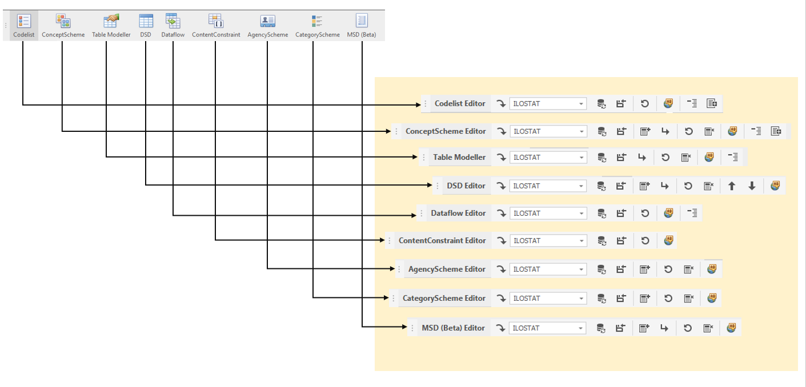
```
[Click here to enlarge the image](images/image032.png)

## Preview and Export Menu

The fourth menu item group (Preview and Export) is in the top right corner and below the first group of menu items (as highlighted below).

```{r 034, echo=FALSE, fig.align="center", out.width="100%"}
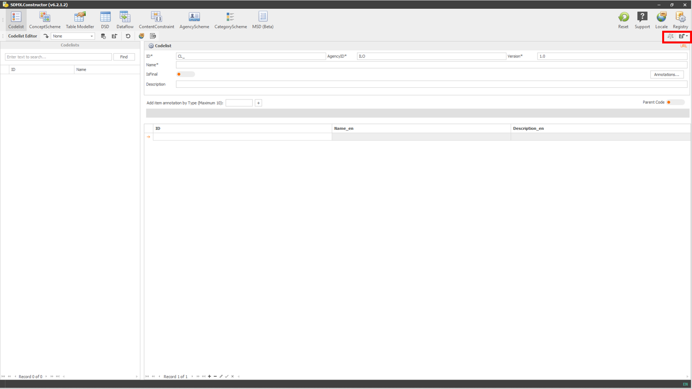
```
[Click here to enlarge the image](images/image034.png)

The options available in this group of menu items are related to the preview and export functionalities of the tool and change according to the menu item selected on the top menu (the second group of menu items (Editors)).

Below are the icons representing the menu items, along with their features. Users can change the size of these icons by right-clicking on any of them, selecting Customize, and selecting the appropriate setting in Options.

| Menu item                  | Names and functions                                                              
|---------------------|---------------------------------------------------|
| 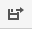   | Export. It saves the SDMX artefact in a local folder. It is available for DSD, Dataflow, ContentConstraint, AgencyScheme, and MSD without specific options. However, options are available to save artefacts from: 1. Codelist (available in the following formats: .Stat v7 Dim, CSV and SDMX-ML) and 2. ConceptScheme, Table Modeller and CategoryScheme (available in two flavours: Save with descendants and Save without descendants).                                                                                       |
|  <br> or <br> 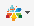   | Push to DLM (DLM is short for Data Lifecycle Manager of the .Stat Suite). This icon becomes active (appears with colours) when the tool is connected with a DLM instance. It is available for Codelist, DSD, Dataflow, ContentConstraint, AgencyScheme, and MSD without specific options. However, options are available to save artefacts from ConceptScheme, Table Modeller and CategoryScheme.         
| 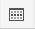   | Structure Viewer. It lets you preview the tabulation and download the MS Excel and CSV templates. It is available for DSD and Dataflow.                                                                                             |

: (#tab:table34) A bird's-eye view of the menu items in the Editor Ribbon

## Working area

The following section explains the working area of the tool.

Below the menu items on top, the user interface appears divided into two main parts. First, the left pane on the interface serves as a space to hold the artefacts' list. The other side is designated to showcase relevant details (both sides are highlighted in different colours in the screenshot below). Selecting (by double-clicking) an artefact from the left pane prompts its details to appear on the screen's right-side pane. This layout is available for Codelist, Dataflow and ContentConstraint.

```{r 040, echo=FALSE, fig.align="center", out.width="100%"}
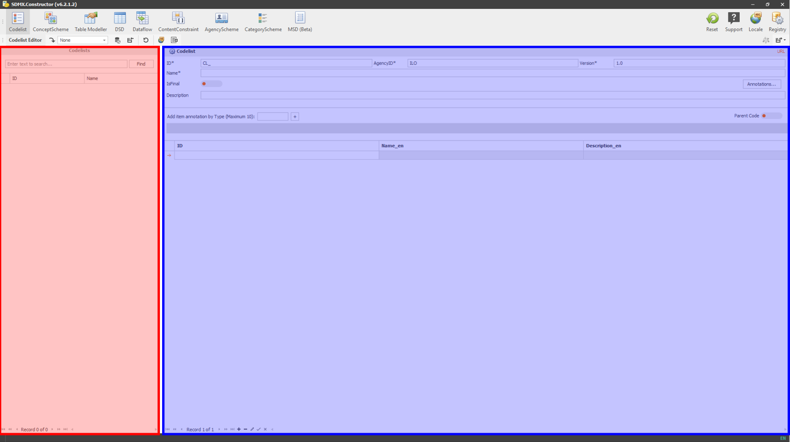
```
[Click here to enlarge the image](images/image040.png)

For ConceptScheme, Table Modeller, DSD, AgencyScheme, CategoryScheme, and MSD, an additional pane also appears in the user interface (below the placeholder for listing the artefacts - (as highlighted below)), which acts as a staging area (or a pool). It becomes a CONCEPTS POOL for ConceptScheme, Table Modeller, DSD and MSD options. And it turns into an AGENCY POOL for AgencyScheme and a CATEGORY POOL for CategoryScheme options.

The users can drag the artefacts back and forth between the pool area and the pane on the right.

```{r 042, echo=FALSE, fig.align="center", out.width="100%"}
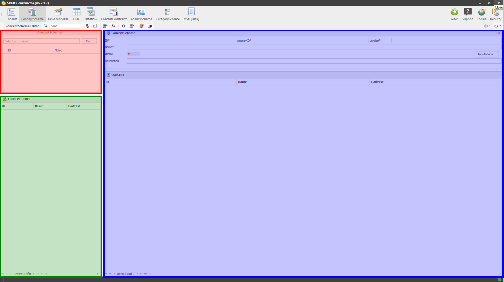
```
[Click here to enlarge the image](images/image042.png)

## Input and output methods

Users can input information into SDMX Constructor in several ways, depending on the specific scenarios. The following are the options. 

-	Typing and copy-pasting: Users can enter information by typing text or copying and pasting into fields in the forms using a keyboard.
-	Clicking: Users can interact with buttons, links, menus, or other graphical elements by clicking with a mouse, touchpad, or touchscreen. For example, double-clicking an artefact from the left pane load its details on the screen’s right-side pane.
-	Dragging and dropping: Users can manipulate objects or select multiple items by dragging and dropping them with a mouse, touchpad, or touchscreen.
-	Loading from online SDMX Registry: Users can access pre-prepared SDMX artefacts from many default online SDMX registries. The input method allows users to retrieve information from the SDMX registry.

SDMX Constructor presents information to users in a standardised and user-friendly way, using a combination of graphical elements, form-based input and validation and error messages. 

-	Graphical interface: The SDMX Constructor uses a graphical user interface (GUI) that allows users to interact with the metadata components using visual elements like buttons, menus, and icons. This makes it easy for users to navigate and manipulate the metadata and get a quick overview of the SDMX artefacts.
-	Form-based input: The SDMX Constructor uses form-based input screens to allow users to enter information about the metadata components. The forms are designed to be intuitive and easy to use, with clear labels, dropdown menus, and text boxes that guide users through the input process.
-	Validation and error messages: The SDMX Constructor validates the metadata components to ensure that they conform to the SDMX standard and are consistent with other components. If there are errors or inconsistencies, the tool provides error messages that help users identify and correct the issues.

## Translation

SDMX Constructor allows users to manage multilingual metadata components easily. Users can choose from automatic or manual translation methods and edit translations using translation tables. The tool simplifies the translation process with standardised language codes and automation and helps users achieve accurate, high-quality translations.

Here are some tool features supporting the translation of SDMX artefacts:

-	Translation into three languages: The tool supports translating content into three languages of your choice. It helps by following two automatic methods, but you can always do it manually if required.
-	Automatic translation methods: Using the Google Translate API key, you can connect with Google’s translation services. Another automated way is using DeepL. The SDMX Constructor allows programmatic access to DeepL’s machine translation technology, bringing high-quality translation capabilities directly to the tool.
-	Translation tables: Using these API keys, the SDMX Constructor provides translation tables, which allow users to edit suggested translations of metadata components in different languages. You can enter translations for different language codes, and the tool will automatically populate the translations in the appropriate fields.
-	Standardised language codes: The SDMX Constructor uses standardised language codes; users can select from a list of pre-defined language codes.
