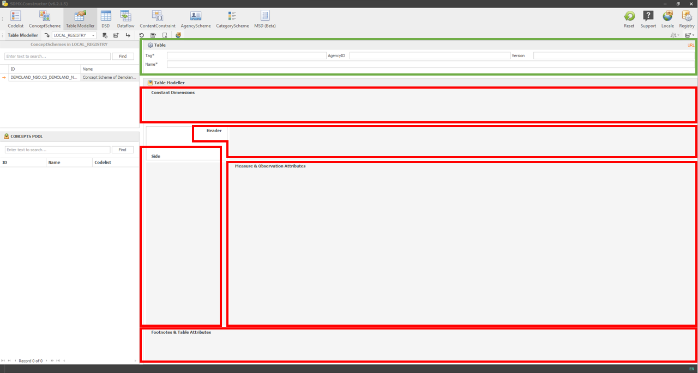

# Special Topics {#special-topics}

This chapter delves into special topics to help you fully utilise this tool. We will cover three key areas.

Firstly, we will explain Annotations in the SDMX Constructor, including how to access the feature and provide an example of it in action.

Next, we will explore Table Modeller, which allows you to easily design statistical tables using an intuitive user interface that generates the appropriate SDMX artefacts.

Lastly, we will discuss performing translations using Google/DeepL API in the SDMX Constructor.

## Annotations

We're working hard on finishing this section. Stay tuned for updates.

## Table Modeller {#table-modeller}

The Table Modeller functionality supports designing statistical tables using an intuitive user interface that generates the SDMX artefacts that model it. The interface is designed to use statistical terms to name objects, hiding the SDMX artefact names wherever possible, making it user-friendly and accessible.

By understanding the user interface (as shown below), the users of the Table Modeller functionality in SDMX Constructor can easily create statistical tables that generate the SDMX artefacts. Note that the table is a view of a container, which defines how the data will be stored. 
 
```{r 234, echo=FALSE, fig.align="center", out.width="100%"}

```
[Click here to enlarge the image](images/image234.png)

The placeholders provided in the Table Modeller interface help users understand and include different concepts in the table and create well-defined SDMX artefacts.

A table in SDMX parlance represents a Dataflow, has a title, and comprises concepts (SDMX CONCEPTS) that take different roles in the table. The Table Modeller interface has various placeholders for the concepts, which are:

-	**Constant Dimensions:** A placeholder for SDMX CONCEPT type DIMENSIONS that remain constant across the table, such as indicator or measure and frequency.

-	**Header:** A placeholder for SDMX CONCEPT type DIMENSIONS that appear at the top of the table, such as time-period.

-	**Side:** A placeholder for SDMX CONCEPT type DIMENSIONS that appear on the left-hand side of the table. It can contain dimensions such as Age or Region (urban/rural).

-	**Measure & Observation Attributes:** A placeholder for observation values (or primary measure) and SDMX CONCEPT type ATTRIBUTES attached at the observation level, such as DECIMALS.

-	**Footnotes & Table Attributes:** A placeholder for SDMX CONCEPT type ATTRIBUTES such as ‘free text’ notes and ‘source’ attached at the dataset level.

**Using the Table Modeller**

-	You can “drag-and-drop” concepts from the CONCEPT POOL on the left panel to the different areas/spaces/placeholders on the right panel.

-	The concepts dropped in the “Side”, “Header”, and “Measure & Observation Attributes” areas will become DIMENSIONS. Note that the relative position of the concept in the area is relevant.

-	Concepts dropped in “Constant Dimensions” will also be DIMENSIONS, but the user will have to select one (and only one) item from each DIMENSION’S Codelist, which will be assigned to it (as ContentConstraint).

-	Concepts dropped in the “Measure & Observation Attributes” area, and the “Footnotes & Table Attributes” area will become ATTRIBUTES, the former attached at the Observation level and the latter at the Dataset level.

-	The outputs of the Table Modeller are the artefacts needed to represent in SDMX the table design.


## Translations using Google API/DeepL

We're working hard on finishing this section. Stay tuned for updates.

