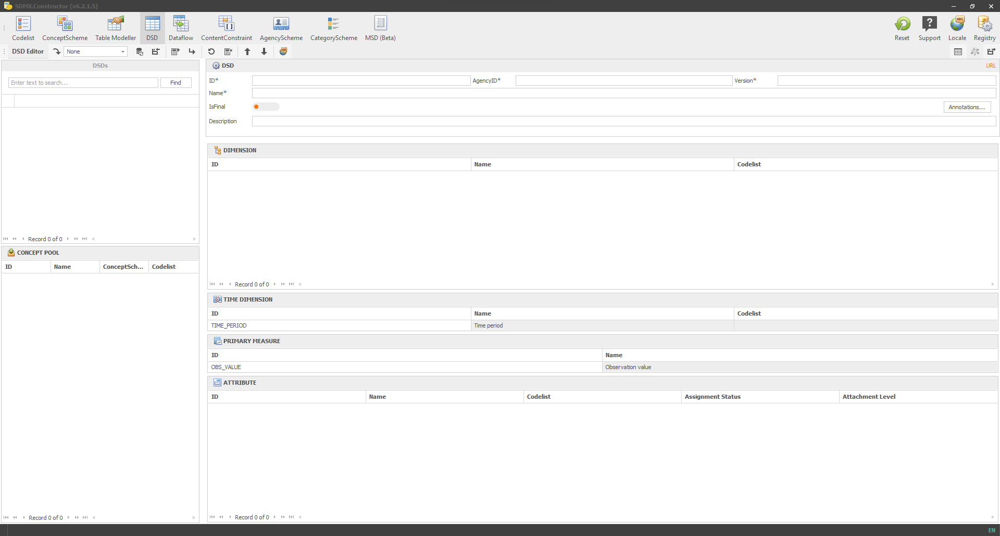

# Preface {.unnumbered}

Welcome to the **ILO's SDMX Constructor User Manual!**

SDMX Constructor[^index-1] is a powerful desktop software tool that helps users model aggregate data per the SDMX standards [^index-2] . It eases generating and editing SDMX artefacts and ultimately supports data availability and access through SDMX-compliant data portals (such as ones built with .Stat Suite[^index-3] ).

[^index-1]: Previously known as DSD Constructor, this software was used for creating and editing Data Structure Definitions (DSDs) and their related artefacts such as concept schemes and code lists. Since then, the software has undergone significant improvements and additions, resulting in a name change to SDMX Constructor. The new name reflects the software's expanded capabilities and makes it more relevant and recognizable to its target audience (<https://ilostat.github.io/dsdc/>).

[^index-2]: SDMX has also been published as an ISO International Standard. <https://www.iso.org/obp/ui/fr/#iso:std:iso:17369:ed-1:v1:en> and <https://sdmx.org/?page_id=5008>

[^index-3]: To learn more about the .Stat Suite platform please refer to the documentation here: <https://siscc.org/stat-suite/>. The SDMX Constructor has been optimised to seamlessly integrate with the .Stat Suite platform, as its back-end client.

SDMX Constructor is one of the tools that comprise the ILO SDMX toolkit [^index-4], alongside SMART (Statistical Metadata-driven Analysis and Reporting Tool) and the SDMX Excel Add-in.

[^index-4]: The ILO offers several tools for Statistical Data and Metadata eXchange (SDMX). <https://ilostat.ilo.org/resources/sdmx-tools/>

This user manual for the SDMX Constructor provides step-by-step instructions on using the tool in a user-friendly and accessible manner. It provides an in-depth understanding of SDMX Constructor's features and functionalities. It is an essential resource for anyone using the tool to manage and share data following the SDMX standards.

Below is a screenshot of the tool's landing page as an example of its user interface.

```{r front-cover, echo=FALSE, fig.align="center", out.width="100%"}

```
[Click here to enlarge the image](images/image001.png)

## Audience and use cases {.unnumbered}

The SDMX Constructor is designed to meet the needs of a wide range of users, from beginners who are new to SDMX to data managers who need advanced capabilities for managing large and complex datasets. In addition to these user types, there may be other groups of users with specific requirements or use cases. This user manual provides guidance and instructions for using the SDMX Constructor, focusing on the needs of these various user types.

**SDMX beginners**: These users are new to SDMX and want to use the SDMX Constructor to view, edit, and create new SDMX structural artefacts. They may need assistance understanding the SDMX concepts, terminology, and the software's user interface.

For SDMX beginners, this manual explains using the SDMX Constructor to access, view, edit, and create SDMX structural artefacts from SDMX registries. While one can find information on SDMX concepts and terminology from other sources, this manual focuses explicitly on the SDMX Constructor. The SDMX beginners may be keen to know how to [view and access SDMX artefacts from SDMX registries](#accessing-sdmx), as well as how to [connect to an SDMX registry](#connecting-to) through the SDMX Constructor.

**Data managers**: These users are likely familiar with the SDMX concepts and terminology and may require information about advanced functionalities offered by the SDMX Constructor. For example, they may want to use the SDMX Constructor as a backend client to manage SDMX artefacts for the .Stat Data Lifecycle Manager (DLM). For such cases, they may also use the SDMX Constructor to build the initial structural metadata when creating a new .Stat Suite instance.

There are several topics that data managers may be interested in learning when it comes to creating SDMX artefacts from scratch. Firstly, they may want to start by [setting up a registry as a local folder](#setting-up). Next, they can [prepare inputs](#preparing-inputs) and create several artefacts, including the [AgencyScheme](#creating-agencyscheme), [ConceptScheme, and Codelist](#creating-conceptscheme) and the [DSD, Dataflow, ContentConstraint, and CategoryScheme](#creating-dsd). After creating these artefacts, they may want to learn how to [upload the XML file to the Data Lifecycle Manager (DLM)](#uploading-xml). Additionally, they may want to know how to [access SDMX artefacts from SDMX registries](#accessing-sdmx) and [connect to an SDMX registry](#connecting-to) for editing SDMX artefacts directly in the DLM.

**SDMX metadata managers**: These users manage SDMX artefacts and ensure their accuracy and consistency. They may use the SDMX Constructor to model data and modify SDMX structural artefacts, including translating SDMX artefacts in various languages, managing annotations and creating Metadata Structure Definition (MSD).

## Scope and assumptions {.unnumbered}

This comprehensive manual provides a step-by-step guide on getting started with the software, including installing it and creating and managing SDMX artefacts. The manual includes a detailed overview of the tool's user interfaces, including menu items, navigation, and other essential features. The manual does not, however, delve into the intricacies of the SDMX standard itself. Describing the SDMX standard is beyond the scope of this manual, as it is an extensive and complex topic requiring more in-depth discussion and is available elsewhere. Instead, the manual assumes that readers are familiar with the SDMX standard and focuses on explaining how to use the tool within that context.

## Overview {.unnumbered}

The chapters in this manual build up toward providing comprehensive guidance that covers topics users need to know to get started with the application, understand its navigation, and use its features and functionalities to model data effectively. The manual includes the following chapters.

-   Chapter 1: [Benefits of SDMX Constructor](#benefits-of)
-   Chapter 2: [Getting Started](#getting-started)
-   Chapter 3: [User Interface](#user-interface)
-   Chapter 4: [Using SDMX Constructor](#using-sdmx)
-   Chapter 5: [Special Topics](#special-topics)

## Contact information {.unnumbered}

For more information and to seek basic technical assistance or support on the tool, please contact the International Labour Organization - Department of Statistics at [sdmx.support\@ilo.org](mailto:sdmx.support@ilo.org){.email}.
